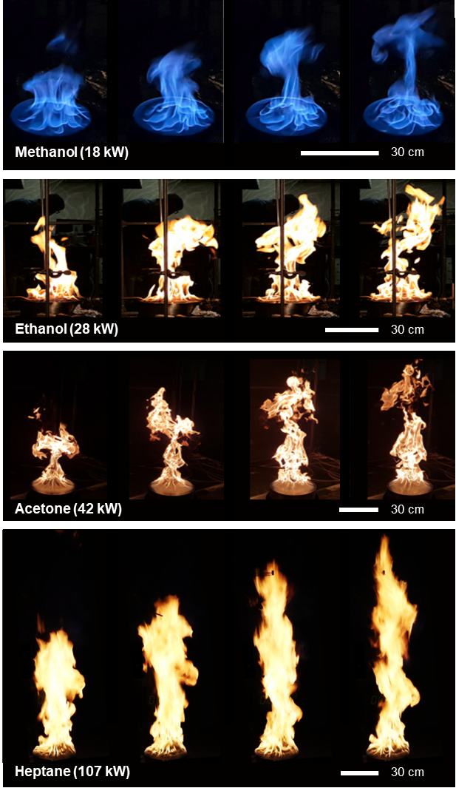
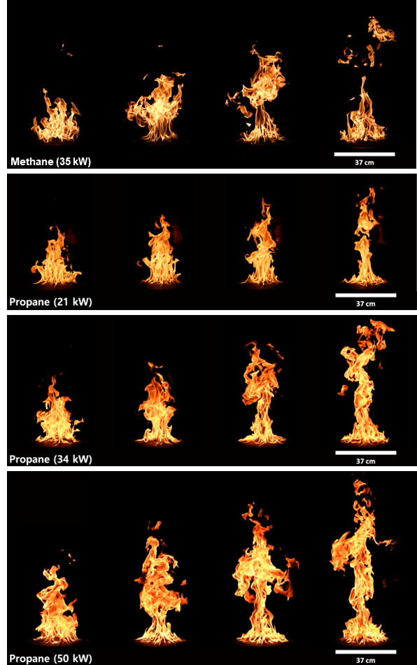
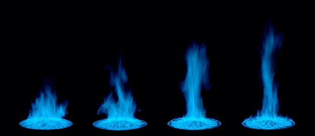
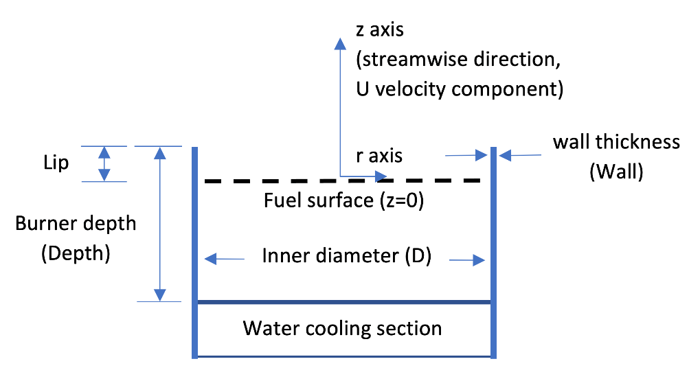
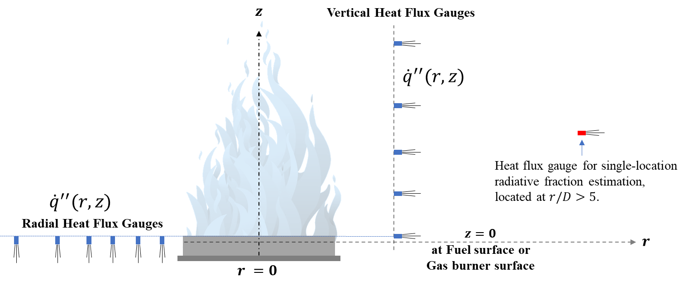

# 1. Overview of NIST Pool Fire Data

The data includes measurements of nine steadily burning liquid and gaseous pool fires on 30 cm, 37 cm, and 100 cm diameter, circular burners. Most of the measurements were conducted at NIST. If measurements by non-NIST authors were identified in the technical literature, those global measurements were included in average values provided here. This document is broken into several parts:

---

<ol>  
1. Overview of NIST Pool Fire Data
     

2\. Description of Burners, Coordinate System and Boundary Conditions

  <ol>

​	2.1. Burners

​	2.2. Fuel Mass Flux

​	2.3. Fuel Surface Temperature

  </ol>

3\. Global Measurements

  <ol>

​	3.1. Heat Release Rate (HRR)

​	3.2. Radiative Fraction

​	3.3. Total Heat Feedback to the Fuel Surface

​	3.4. Soot and CO Yields

​	3.5. Combustion Efficiency

​	3.6. Puffing Frequency

​	3.7. Flame Height

  </ol>

4\. Local Measurements

  <ol>

​	4.1. Gas-Phase Temperature

​	4.2. Gas-Phase Velocity

​	4.3. Gas Species and Soot

​	4.4. Heat Flux

​	4.5. Liquid Fuel Temperature

  </ol>

5\. References

6\. List of Contributors to the Measurements

7\. APPENDIX
</ol>

---

**Table 1.1** presents a compilation of measurement data taken from NIST publications, and when available from the technical literature, characterizing the global features of the nine pool fires documented here. The nine fires include eight medium-scale pool fires (0.3 m to 0. 4 m) burning a variety of liquid and gaseous fuels, including four 30 cm diameter liquid pool fires burning methanol, ethanol, acetone, and heptane, and four 37 cm diameter gaseous pool fires burning methane (34 kW) and propane (20 kW, 34 kW, and 50 kW). A 100 cm diameter liquid pool fire-burning methanol is also included. The table shows the average values of the pool fires’ mass burning flux, the radiative fraction, the heat feedback to the pool surface, flame height, fractional heat feedback to the fuel from the fire, and the CO and soot yields. A companion table (**Table 7.1)** in the Appendix provides references for each of the measurements used in the compilation. Additional types of data on the 30 cm methanol and acetone pool fires from the University of Waterloo is available on the MaCFP GitHub website: <https://github.com/MaCFP/macfp-db/tree/master/Liquid_Pool_Fires/Waterloo_Methanol>.

**Table 1.1 Compilation of mean global pool fire characteristics from the literature, including the measured fuel mass flux ($\dot{m}\prime\prime$), fuel surface temperature ($T_{\rm s}$), radiative fraction ($\chi_{\rm rad}$), the dominant puffing frequency, the flame height ($L_{\rm f}$), the fractional heat feedback to the fuel surface ($\chi_{\rm s}$), and the yields of CO ($y_{\rm CO}$) and soot ($y_{\rm s}$). The uncertainties in the table represent the standard deviation of the averaged values (no uncertainty is reported in the table if there was only one measurement.**

| ID   | Fuel   | $\dot{m}\prime\prime$ | $T_{\rm s}$[a] | $\chi_{\rm rad}$ | $\chi_{\rm s}$ | $y_{\rm CO}$  | $y_{\rm s}$ | Freq. | $L_{\rm f}$ |
|:----:|:------:|:------:|:----:|:------:|:-------:|:------:|:------:|:------:|:------:|
| cm   | \-     | g/(m2 s) | °C | \- | \- |  10-3 g/g |  10-3 g/g | Hz | m |
| 30.1 | Methanol | 13.1 ± 0.8 | 65 ± 1 | 0.24 ± 0.01 | 0.082 | [b] | 0 [c] | 2.7 ± 0.1 | 0.41 ± 0.06 |
| 30.1 | Ethanol  | 14.6 ± 0.9 | 79 ± 2 | 0.26 | 0.050 | 0.3 ± 0.1 | [b] | 2.4 | 0.60 |
| 30.1 | Acetone  | 18.8 ± 1.0 | 57 ± 1 | 0.31 | 0.046 | 1.0 ± 0.2 | 0.9 ± 0.3 | 2.5 | 0.84 |
| 30.1 | Heptane  | 35.5 ± 1.4 | na | 0.31 ± 0.04 | 0.011 | 10.1 ± 1.3 | 16.9 ± 0.5 | 2.8 | 1.32 ± 0.01 |
| 37   | Methane  | 6.4 | 73 ± 2 | 0.21±0.002 | 0.048 ± 0.023 | 1.2 ± 0.1 | [b] | 2.5 | 0.74 ± 0.03 |
| 37   | Propane    | 4.2 | 71 | 0.21 ± 0.03 | 0.130 | 4.0 ± 0.4 | 1.9 ± 0.5 | 2.2 | 0.53 |
| 37   | Propane    | 6.9 | 77 | 0.28 ± 0.03 | 0.078 ± 0.002 | 3.6 ± 0.4 | 4.6 ± 0.4 | 2.4 | 0.75 |
| 37   | Propane    | 10.0 | 76 | 0.33 | 0.048 ± 0.003 | 3.4 ± 0.3 | 5.6 ± 0.3 | 2.4 | 0.96 |
| 100.6 | Methanol| 15.9 ± 0.6 | 65 ± 1 | 0.20 ± 0.01 | na | 0.16 ± 0.02 | [c] | 1.4 | 1.23 ± 0.13 |

[a] The fuel surface temperature for the liquid pool fires is near the fuel boiling point \[1, 2, 3\]. Measurements at the pool surface \[1, 2\] also show that the temperature of the liquid fuels slowly increases by 2 °C/hr. See discussion below.

[b] below detection limit (\< 10-4).

[c] soot was not observed at any fire location.

-Parmameters indecated by "na" are not available.

---

Figures 1.1, 1.2, and 1.3 show sequential images of the steadily burning fires during a single puffing cycle. For the fires to become quasi-steady, a warm-up period of 5 to 10 minutes after ignition was required.

**Figure 1.1 Sequential photographs during a puffing cycle of the 30 cm pool fires; Methanol, Ethanol, Acetone and Heptane. \[**1**\]**

**Figure 1.2 Sequential photographs during a puffing cycle of the 37 cm gas burner fires; Propane 20 kW, Propane 34 kW and Propane 50 kW. \[**1**\]**

**Figure 1.3 Sequential photographs during a puffing cycle of the 100 cm methanol pool fire. \[**2**\]**

# 2. Description of Burners, Coordinate System and Boundary Conditions

## 2.1. Burners

**Figure 2.1 Schematic drawing of a liquid burner, illustrating the coordinate system.**

The image above is a schematic drawing of the burners, illustrating its features and the coordinate system used here. **Table 2.1** below lists the 30 cm and 100 cm liquid burners’ diameter, depth, and wall thickness for various studies of interest. The lip height (distance between the fuel surface and the top of the burner rim) used in the multiple references is also listed. The 37 cm NIST gas burner and the Waterloo liquid burner are also listed for comparison.

**Table 2.1. Description of NIST and Waterloo burners, including the inner diameter, lip height, depth, wall thickness, and material composition. Also shown, is whether the burner is water-cooled.**

| **ID (cm)** | **Lip (mm)** | **Depth (cm)** | **Wall (mm)** | **Material** | **Water-Cooled Burner?** | **References** |
|:-------:|:------:|:--------:|:-------:|:----------:|:---------------:|:-------:|
| 30.1 | 5 | 15 | 1.3 | stainless steel | Yes | 2, 4, 5, 6 |
| 30.1 | 10 | 15 | 1.3 | stainless steel | Yes | 1, 7, 8, 9, 10 |
| 30.5 | 10 | 6 | 1.5 | stainless steel | no | 11, 12, 14, 15, 27 |
| 37 | 0 | 8 | na | porous bronze | Yes | 1, 4, 13, 14 |
| 100 | 5 | 15 | 1.7 | steel | Yes | 15 |
| 100 | 10 | 15 | 1.7 | steel | Yes | 2 |

-   For convenience, all experimental data reported here use a cylindrical coordinate system with the **fuel surface as the z-axis origin** (see burner drawing above) and the pool center as the r-axis origin. The coordinate frame, therefore, differs from what was reported in the literature such that the origin is the fuel surface instead of the top of the burner rim. (Many of the liquid pool fire studies report results using the top of the burner rim (or lip) as the z-axis origin \[e.g., 5, 6, 9, 15\]. Other liquid pool fire studies report results using the fuel surface as the z-axis origin \[8\].)
-   The “30 cm NIST burner” is made of stainless steel and has an inner diameter (ID) of 30.1 cm, a wall thickness of 1.3 mm, and a depth of 15 cm \[9\]. The stainless steel burner is fitted with legs, so the burner rim is positioned 30 cm above the floor. The bottom of the burner is maintained near-constant by flowing tap water (nominally 20 °C) through a 3 cm section attached to the bottom of the fuel pan.
-   The “100 cm NIST burner” is made of steel and has an inner diameter of 100 cm, a depth of 15 cm, and a wall thickness of 1.6 mm. The bottom of the burner is maintained a near-constant temperature by flowing tap water (about 17 ± 3°C) through a 3 cm section attached to the bottom of the fuel pan. The burner was positioned on bricks such that the rim was about 40 cm above the floor \[1, 2\].
-   The Waterloo burner was reported to be 30.5 cm in diameter \[16\]. The outer diameter of the burner is equal to 30.5 cm, the wall thickness is 0.15 cm, and the depth is 6.0 cm \[17\], so the inner diameter is 30.2 cm. The lip height of the fire in the Waterloo burner was maintained at 10 mm. The burner was not water-cooled on the bottom of its fuel section. Additional information is available at: <https://github.com/MaCFP/macfp-db/tree/master/Liquid_Pool_Fires/Waterloo_Methanol>.
-   The **lip height** (distance from the top of the burner rim to the fuel surface - see the burner schematic drawing above) varied from study to study (see **Table 2.1** above).
-   For the 30 cm diameter methanol pool fires, Refs. \[1, 2, 8, 9, 16\] report a lip height of 10 mm, whereas other studies \[5, 6, 15\] report a lip height of 5 mm.
-   For the 30 cm diameter ethanol and acetone pool fires, Ref. \[9\] reports a lip height of 10 mm.
-   The lip height of the 37 cm gaseous burner was zero.

## 2.2. Fuel Mass Flux

-   **Table 1.1** above shows the measured mass flux for all the pool fires is averaged over results available in the literature.

## 2.3. Fuel Surface Temperature

-   **Table 1.1** above shows the measured fuel surface temperatures for the fires burning liquid and gaseous fuels.

-   For the liquid fuels studied here, measurements show that the fuel surface temperature is close to the fuel boiling point \[1, 2, 3\].

-   Measurements at the pool surface \[1, 2\] showed that the temperature of the steadily burning liquid fuels was initially the boiling point of the pure fuel and then slowly increased on the order of 2 °C/hr. We speculate that this is due to the slow back-diffusion of gas-phase water (as well as possibly other molecules) condensing on the liquid fuel surface, diluting the composition of the liquid pool surface from that of pure fuel. Contaminants, such as water and formic acid, have been observed to increase with time when burning liquid heptane.

-   The 37 cm gaseous burner (zero lip height) is water-cooled and maintains a near-isothermal (±20 K) temperature about the burner surface as documented by IR camera measurements. \[1\] Type K thermocouple measurements of the surface show that its temperature is within 10 °C of the outflow temperature of the gas burner’s cooling water (which depends on the water flow rate - nominally set to about 1 L/min). The surface temperature was typically 60 °C for the data sets reported here.

# 3. Global Measurements

## 3.1. Heat Release Rate (HRR) 

-   **Table 1.1** above shows the measured mass flux and radiative fraction of the pool fires. For convenience, the measured mass flux per unit area of the fuel surface (kg/(m2 s)) and the radiative fraction are provided in the files listed in **Table 3.1** :

**Table 3.1 Heat release rate and radiative fraction data filenames and description.**

| **Experimental Data** **Filename** | **Description** |
|:----------------------------:|:----------------------------------------:|
| Methanol_30_cm_HRR_Sung_2024.csv | Mass flux per unit area of the fuel surface and the radiative flux \[1\] |
| Acetone_30_cm_HRR_Sung_2024.csv | Mass flux per unit area of the fuel surface and the radiative flux \[1\] |
| Ethanol_30_cm_HRR_Sung_2024.csv | Mass flux per unit area of the fuel surface and the radiative flux \[1\] |
| Heptane_30_cm_HRR_Sung_2024.csv | Mass flux per unit area of the fuel surface and the radiative flux \[1\] |
| Methane_37_cm_34_kW_HRR_Sung_2024.csv | Mass flux per unit area of the fuel surface and the radiative flux \[1\] |
| Propane_37_cm_20_kW_HRR_Sung_2024.csv | Mass flux per unit area of the fuel surface and the radiative flux \[1\] |
| Propane_37_cm_34_kW_HRR_Sung_2024.csv | Mass flux per unit area of the fuel surface and the radiative flux \[1\] |
| Propane_37_cm_50_kW_HRR_Sung_2024.csv | Mass flux per unit area of the fuel surface and the radiative flux \[1\] |
| Methanol_100_cm_HRR_Sung_2024.csv | Mass flux per unit area of the fuel surface and the radiative flux \[1\] |

## 3.2. Radiative Fraction

-   **Table 1.1** above shows the measured radiative fraction for the pool fires, averaged over the results reported by the cited references.

-   The measured radiative fraction for the 30 cm methanol pool fire, averaged over the various studies, is 0.24 ± 0.01 based on the cited references \[1, 4, 5, 15\]; also see discussion of Ref. \[15\] in Ref. \[2\]. The radiative fraction in Refs. \[1, 3\] was calculated using the measured radiative fraction emitted to surroundings except the fuel surface ($\chi_{r}$); the method was explained in Ref. \[9\].

-   The measured radiative fraction for the 100 cm methanol pool fire is 0.20 ± 0.01. \[2, 15\]. The radiative fraction for the 100 cm methanol pool fire reported by Klassen and Gore \[15\] was recalculated using the net (rather than the gross) heat of combustion ($H_{c}$) with water as a gaseous product (19,940 kJ/kg \[3\]) and to correct a typo in their report of the distance of the radiometer from the fire to improve the estimate of radiative heat feedback to the pool surface (see details in Ref. \[2\]).

-   The same, identical, three burners (0.30 m, 0.37 m, and 1.0 m diameter) were used in Refs. \[1, 2, 4-10, 13-15, 18\].

  

## 3.3. Total Heat Feedback to the Fuel Surface

-   **Table 3.2** lists ideal heat release rate($\dot{Q}$), total heat feedback ($\dot{Q}\_s$) to the fuel surface, and fractional heat feedback ($\chi\_{s}$) for the nine pool fires.

-   For the gaseous fuels, the water-cooled burner acted like a calorimeter, and (${\dot{Q}}_{s}$) was determined from the enthalpy change associated with the cooling water (from the measured temperature difference between the water-cooling inlet and outlet on the burner and the flow rate of the water). \[1\]

-   For the liquid fuels in the 30 cm diameter burner, the total heat feedback incident on the pool surface (${\dot{Q}}_{s}$) was estimated by integrating the measured profile of the local total heat flux just above the fuel surface over the entire pool surface area in the methanol \[9\], acetone \[9\], ethanol fires \[9\] and heptane \[5\] fires.

-   The fractional heat feedback incident on the pool surface ($\chi\_{s}$) was taken as approximately equal to the total heat feedback to the fuel surface (${\dot{Q}}\_{s}$) divided by the idealized fire heat release rate ($\dot{Q}$), defined as $\dot{m}H\_{c}$; where $\dot{m}$ is the mass burning rate (g/s).

**Table 3.2. The ideal heat release rate ($\dot{Q}$), total heat feedback to the fuel surface ($\dot{Q}\_{s}$), and fractional heat feedback onto the pool surface ($\chi\_{s}$) for the nine pool fire studied here. Uncertainty represents a 95 % confidence interval (k=2).**

| **D (cm)** | **Fuel** | $\dot{Q}$ **(kW)** | $\dot{Q}\_{s}$ **(kW)** | $\chi\_{s}$ **(-)** |
|:-------------:|:-------------:|:-------------:|:-------------:|:-------------:|
| 30.1 | Methanol | 19.2 ± 1.7 | 1.60 ± 0.38 | 0.082 ± 0.020 |
| 30.1 | Acetone | 31.0 ± 3.4 | 1.60 ± 0.38 | 0.050 ± 0.012 |
| 30.1 | Ethanol | 38.1 ± 4.2 | 1.70 ± 0.41 | 0.046 ± 0.011 |
| 30.1 | Heptane | 116.0 ± 11.6 | 1.32 ± 0.26 | 0.011 ± 0.003 |
| 37 | Methane | 34.5 ± 0.5 | 2.46 ± 0.22 | 0.07 ± 0.003 |
| 37 | Propane | 20.7 ± 0.9 | 2.64 ± 0.17 | 0.13 ± 0.010 |
| 37 | Propane | 34.4 ± 1.2 | 2.90 ± 0.23 | 0.08 ± 0.007 |
| 37 | Propane | 50.1 ± 1.7 | 2.49 ± 0.21 | 0.05 ± 0.005 |

## 3.4. Soot and CO Yields

-   **Table 1.1** above lists the mean soot yield ($Y_{s}$) and its standard deviation from multiple measurements made in the exhaust stream using laser transmission at 632 nm. \[8, 19\] The mass specific soot extinction coefficient in all cases was taken as 8.7 m2/g \[20\]. **Table 1.1** also lists the mean soot yield ($Y_{s}$) and its standard deviation from multiple measurements made in the exhaust stream using laser transmission at 632 nm. \[8, 19\] The mass specific soot extinction coefficient in all cases was taken as 8.7 m2/g \[20\].

-   The CO yield ($Y_{CO}$) shown in **Table 1.1** was determined using extractive sampling of the exhaust stream analyzed by non-dispersive infrared analysis in tandem with temperature and velocity measurements used to determine the exhaust mass flow. \[8, 19\]

## 3.5. Combustion Efficiency

-   For the pool fires considered here, **Table 1.1** shows that the amounts of CO and soot in the exhaust stream were relatively small except in the heptane fire. Determining the combustion efficiency using the measured HRR leads to relatively large uncertainties and is not considered here.\[8\] In this study, the combustion efficiency is assumed to be approximately 1.

## 3.6. Puffing Frequency

-   **Table 1.1** above lists the dominant puffing frequency of the fires, which was determined from a fast Fourier transform of (a) the transient local thermocouple temperature measured at multiple locations or (b) tracking the pulsingfire from the video record. \[8\]

-   The same pool fire puffing frequency (f) is expected for pool fires of the same diameter (*D*): **f = 1.5/√D**. \[21\]

## 3.7. Flame Height

-   **Table 1.1** above lists the mean flame height ($L_{f}$), which was measured by analyzing the video record of the fire.
-   The mean flame height was found to be highly similar (within 2 %) to the 50 % intermittency height, as expected for a Gaussian distribution of the transient flame height about the mean. \[14\] The uncertainties in the table represent the standard deviation of the measured values.

# 4. Local Measurements

## 4.1. Gas-Phase Temperature

-   Mean and RMS thermocouple temperature measurements (TC and TC_RMS) were made in the fire using fine-wire, bare-bead, Type S, thermocouples.

-   The mean gas temperatures (TG) were estimated considering radiative loss and thermal inertia associated with the thermocouples.

-   The thermocouple beads were observed to be nearly spherical using a microscope. When removed from the fires, the thermocouples appeared shiny and metallic, so the emissivity was taken as that of the virgin thermocouple material (platinum). \[22\]

-   **Table 4.1** below lists the temperature data filenames with a brief description, including the thermocouple bead diameter used for each temperature profile.

-   The uncertainty of the mean gas temperature is 5.2% as discussed in detail in Ref. \[1\].

**Table 4.1 Temperature data filenames and description.**

| **Experimental Data** **Filename** | **Description** |
|:-----------------------------:|:---------------------------------------:|
| Methanol_30_cm_TC_r=0_cm_Sung_2024.csv | Centerline thermocouple and gas temperature measurements; type S thermocouple bead diameter = 52 μm. \[1\] |
| Methanol_30_cm_TC_z=41_cm_Sung_2024.csv | Radial thermocouple temperature measurements made at z=41 cm above the fuel surface; type S thermocouple bead diameter = 150µm. \[1\] |
| Methanol_30_cm_TC_z=51_cm_Sung_2024.csv | Radial thermocouple temperature measurements made at z=51 cm above the fuel surface; type S thermocouple bead diameter = 150µm. \[1\] |
| Methanol_30_cm_TC_z=61_cm_Sung_2024.csv | Radial thermocouple temperature measurements made at z=61 cm above the fuel surface; type S thermocouple bead diameter = 150µm. \[1\] |
| Ethanol_30_cm_TC_r=0_cm_Sung_2024.csv | Centerline thermocouple and gas temperature measurements; type S thermocouple bead diameter = 125 μm and 199 μm. \[1\] |
| Acetone_30_cm_TC_r=0_cm_Sung_2024.csv | Centerline thermocouple and gas temperature measurements; type S thermocouple bead diameter = 103 μm. \[1\] |
| Heptane_30_cm_TC_r=0_cm_Sung_2024.csv | Centerline thermocouple and gas temperature measurements; type S thermocouple bead diameter = 125 μm. \[1\] |
| Methane_37_cm_TC_r=0_cm_Sung_2024.csv | Centerline thermocouple and gas temperature measurements; type S thermocouple bead diameter = 52 μm, 119 μm. \[1\] |
| Propane_37_cm_20_kW_TC_r=0_cm_Sung_2024.csv | Centerline thermocouple and gas temperature measurements; type S thermocouple bead diameter = 39 μm. \[1\] |
| Propane_37_cm_34_kW_TC_r=0_cm_Sung_2024.csv | Centerline thermocouple and gas temperature measurements; type S thermocouple bead diameter = 39 μm. \[1\] |
| Propane_37_cm_50_kW_TC_r=0_cm_Sung_2024.csv | Centerline thermocouple and gas temperature measurements; type S thermocouple bead diameter = 39 μm. \[1\] |
| Methanol_100_cm_TC_r=0_cm_Sung_2021.csv | Centerline thermocouple and gas temperature measurements; type S thermocouple bead diameter=153µm. \[2\] |
| Methanol_100_cm_TC_z=21_cm_Sung_2021.csv | Radial thermocouple and gas temperature measurements at z=21 cm above the fuel surface; type S thermocouple bead diameter=153µm. \[2\] |
| Methanol_100_cm_TC_z=61_cm_Sung_2021.csv | Radial thermocouple and gas temperature measurements at z=61 cm above the fuel surface; type S thermocouple bead diameter=153µm. \[2\] |
| Methanol_100_cm_TC_z=101_cm_Sung_2021.csv | Radial thermocouple and gas temperature measurements at z=101 cm above the fuel surface; type S thermocouple bead diameter=153µm. \[2\] |
| Methanol_100_cm_TC_z=141_cm_Sung_2021.csv | Radial thermocouple and gas temperature measurements at z=141 cm above the fuel surface; type S thermocouple bead diameter=153µm. \[2\] |
| Methanol_100_cm_TC_z=181_cm_Sung_2021.csv | Radial thermocouple and gas temperature measurements at z=181 cm above the fuel surface; type S thermocouple bead diameter=153µm. \[2\] |

## 4.2. Gas-Phase Velocity

-   Bi-directional probe measurements were made at various z locations on the centerline of the pool fires, mapping the distribution of speed in the upward direction.

-   **Table 4.2** below lists the velocity data filenames with a brief description. Velocity data in the upward direction is available for all of the configurations in **Table 1.1** except the 1 m Methanol pool fire.

**Table 4.2 Velocity data filenames and description.**

| **Experimental Data** **Filename** | **Description** |
|:-------------------------------:|:-------------------------------------:|
| Methanol_30_cm_U_r=0_Sung_2024.csv | Profile of the vertical component of velocity in the upward direction as a function of distance (z) above the fuel surface. \[1\] |
| Ethanol_30_cm_U_r=0_Sung_2024.csv | Profile of the vertical component of velocity in the upward direction as a function of distance (z) above the fuel surface. \[1\] |
| Acetone_30_cm_U_r=0_Sung_2024.csv | Profile of the vertical component of velocity in the upward direction as a function of distance (z) above the fuel surface. \[1\] |
| Heptane_30_cm_U_r=0_Sung_2024.csv | Profile of the vertical component of velocity in the upward direction as a function of distance (z) above the fuel surface. \[1\] |
| Methane_37_cm_U_r=0_Sung_2024.csv | Profile of the vertical component of velocity in the upward direction as a function of distance (z) above the burner surface. \[1\] |
| Propane_20_kW_37_cm_U_r=0_Sung_2024.csv | Profile of the vertical component of velocity in the upward direction as a function of distance (z) above the burner surface. \[1\] |
| Propane_34_kW_37_cm_U_r=0_Sung_2024.csv | Profile of the vertical component of velocity in the upward direction as a function of distance (z) above the burner surface. \[1\] |
| Propane_50_kW_37_cm_U_r=0_Sung_2024.csv | Profile of the vertical component of velocity in the upward direction as a function of distance (z) above the burner surface. \[1\] |

## 4.3. Gas Species and Soot

-   Gas species measurements were made along the fire centerline (r=0), using extractive sampling with a water-cooled probe and injecting the sample into a gas chromatograph/mass spectrometer system (GC/MSD). The volume fraction of each species was calculated based on the number of moles measured by the GC/MSD. \[8\]

-   Local measurements of the soot mass fractions were determined gravimetrically using extractive gas sampling.

-   **Table 4.3** below lists the species data filenames with a brief description. Gas species data is available for all of the configurations in **Table 1.1** except for the 1 m Methanol pool fire. The uncertainties in the table represent the expanded combined uncertainty (k=2). \[8\] The data sets also list the total hydrocarbons (HC) measured.

**Table 4.3 Gas species data filenames and description.**

| **Experimental Data Filename** | **Description** |
|:----------------------------------:|:----------------------------------:|
| Acetone_30_cm_species_r=0_Falkenstein-Smith_2021a.csv | Mean gas species, soot, and their uncertainties as a function of distance above the fuel surface along the pool centerline (r=0). \[8\] |
| Ethanol_30_cm_species_r=0_Falkenstein-Smith_2021a.csv | Mean gas species, soot, and their uncertainties as a function of distance (z) above the fuel surface along the pool centerline (r=0). \[8\] |
| Methanol_30_cm_species_r=0_Falkenstein-Smith_2021a.csv | Mean gas species and their uncertainties as a function of distance (z) above the fuel surface along the pool centerline (r=0). There is no measurable soot in the methanol fire. \[8\] |
| Methane_37_cm_species_r=0_Falkenstein-Smith_2021a.csv | Mean gas species, soot, and their uncertainties as a function of distance (z) above the fuel surface along the pool centerline (r=0). \[8\] |
| Propane_37_cm_20_kW_species_r=0_Falkenstein-Smith_2021a.csv | Mean gas species, soot, and their uncertainties as a function of distance (z) above the fuel surface along the pool centerline (r=0). \[14\] |
| Propane_37_cm_34_kW_species_r=0_Falkenstein-Smith_2021a.csv | Mean gas species, soot, and their uncertainties as a function of distance (z) above the fuel surface along the pool centerline (r=0). \[14\] |
| Propane_37_cm_50_kW_species_r=0_Falkenstein-Smith_2023.csv | Mean gas species, soot, and their uncertainties as a function of distance (z) above the fuel surface along the pool centerline (r=0). \[14\] |

## 4.4. Heat Flux

-   Radiative and total heat flux measurements were made at various locations in the pool fires, mapping the heat flux emitted (1) radially outward away from the fire acquired at various heights above the fuel surface through the side surface of a cylindrical control volume about the fire (with the side surface located a distance r from the burner center) and (2) downwards through the bottom surface of a cylindrical control volume about the fire (with the bottom surface located a distance z above the fuel surface). See **Figure 4.1**.

**Figure 4.1 Schematic of the heat flux gauge set-up.**

-   The relative expanded combined uncertainty (k=2) of the heat flux in the 30 cm and 37 cm pool fires is equal to 20 %. See the detailed discussion in Ref. \[1\]
-   **Table 4.4** below lists the heat flux data filenames with a brief description.

**Table 4.4 Heat flux data filenames and description.**

| **Experimental Data Filename** | **Description** |
|:----------------------------------:|:----------------------------------:|
| Methanol_30cm_HF_radial_z=1_cm_Sung_2024.csv | Radial profile of total heat flux in the downward direction from near the burner edge (r = 16.1 cm) to r = 150 cm. The heat flux gauges were z =1 cm above the burner surface and oriented upwardly. \[1\] |
| Acetone_30_cm_HF_radial_z=1_cm_Sung_2024.csv | Radial profile of total heat flux in the downward direction from near the burner edge (r = 18 cm) to r = 184 cm. The heat flux gauges were z =1 cm above the burner surface and oriented upwardly. \[1\] |
| Ethanol_30_cm_HF_radial_z=1_cm_Sung_2024.csv | Radial profile of total heat flux in the downward direction from near the burner edge (r = 18 cm) to r = 183 cm. The heat flux gauges were z =1 cm above the burner surface and oriented upwardly. \[1\] |
| Methane_37_cm_HF_radial_z=0_cm_Sung_2024.csv | Radial profile of total heat flux in the downward direction from near the burner edge (r = 24 cm) to r = 177 cm. The heat flux gauges were z =0 cm above the burner surface and oriented upwardly. \[1\] |
| Propane_37_cm_20_kW_HF_radial_z=0_cm_Sung_2024.csv | Radial profile of total heat flux in the downward direction from near the burner edge (r = 24 cm) to r = 177 cm. The heat flux gauges were z =0 cm above the burner surface and oriented upwardly. \[1\] |
| Propane_37_cm_34_kW_HF_radial_z=0_cm_Sung_2024.csv | Radial profile of total heat flux in the downward direction from near the burner edge (r = 24 cm) to r = 177 cm. The heat flux gauges were z =0 cm above the burner surface and oriented upwardly. \[1\] |
| Methanol_30_cm_HF_Vertical_r=60cm_Sung_2024.csv | Vertical profiles of total heat flux emitted radially away from the fire acquired at r=60 cm. The heat flux gages were located above the burner surface (z) from 0 cm to 130 cm and oriented towards the fire centerline. \[1\] |
| Methanol_30_cm_HF_Vertical_r=83cm_Sung_2024.csv | Vertical profiles of total heat flux emitted radially away from the fire acquired at r=83 cm. The heat flux gages were located above the burner surface (z) from 20 cm to 110 cm and oriented towards the fire centerline. \[1\] |
| Acetone_30_cm_HF_Vertical_r=184cm_Sung_2024.csv | Vertical profiles of total heat flux emitted radially away from the fire acquired at r=184 cm. The heat flux gages were located above the burner surface (z) from 1 cm to 219 cm and oriented towards the fire centerline. \[1\] |
| Ethanol_30_cm_HF_Vertical_r=183cm_Sung_2024.csv | Vertical profiles of total heat flux emitted radially away from the fire acquired at r=183 cm. The heat flux gages were located above the burner surface (z) from 1 cm to 219 cm and oriented towards the fire centerline. \[1\] |
| Methane_37_cm_HF_Vertical_r=177cm_Sung_2024.csv | Vertical profiles of total heat flux emitted radially away from the fire acquired at r=177 cm. The heat flux gages were located above the burner surface (z) from 0 cm to 209 cm and oriented towards the fire centerline. \[1\] |
| Propane_37_cm_20_kW_HF_Vertical_r=177cm_Sung_2024.csv | Vertical profiles of total heat flux emitted radially away from the fire acquired at r=177 cm. The heat flux gages were located above the burner surface (z) from 0 cm to 209 cm and oriented towards the fire centerline. \[1\] |
| Propane_37_cm_34_kW_HF_Vertical_r=177cm_Sung_2024.csv | Vertical profiles of total heat flux emitted radially away from the fire acquired at r=177 cm. The heat flux gages were located above the burner surface (z) from 0 cm to 209 cm and oriented towards the fire centerline. \[1\] |
| Propane_37_cm_50_kW_HF_Vertical_r=177cm_Sung_2024.csv | Vertical profiles of total heat flux emitted radially away from the fire acquired at r=177 cm. The heat flux gages were located above the burner surface (z) from 0 cm to 209 cm and oriented towards the fire centerline. \[1\] |
| Methanol_100_cm_HF_radial_z=1_cm_Sung_2021a.csv | Radial profile of total heat flux in the downward direction from the burner edge (r = 50 cm) to r = 200 cm. The heat flux gauges were 1 cm above the fuel surface and oriented upwardly. \[2\] |
| Methanol_100_cm_HF_Vertical_z=41_cm_Sung_2021a.csv | Vertical profiles of total heat flux emitted radially from the fire acquired at z=41 cm above the fuel surface for varying r distances with the gauges oriented towards the fire centerline. \[2\] |
| Methanol_100_cm_HF_Vertical_z=61_cm_Sung_2021a.csv | Vertical profiles of total heat flux emitted radially from the fire acquired at z=61 cm above the fuel surface for varying r distances with the gauges oriented towards the fire centerline. \[2\] |
| Methanol_100_cm_HF_Vertical_z=81_cm_Sung_2021a.csv | Vertical profiles of total heat flux emitted radially from the fire acquired at z=81 cm above the fuel surface for varying r distances with the gauges oriented towards the fire centerline. \[2\] |
| Methanol_100_cm_HF_Vertical_r=207p5_cm_Sung_2021a.csv | Vertical profiles of total heat flux emitted radially from the fire acquired at r=207.5 cm above the fuel surface for z distances from 1 to 180.5 cm above the fuel surface with the gauges oriented towards the fire centerline. \[2\] |

## 4.5. Liquid Fuel Temperature

-   **Table 4.5** below lists the liquid fuel temperature data filenames and a brief description.

-   Type K thermocouples were used to measure time-varying temperatures inside the steadily burning liquid pools at various (z, r) locations, where z=0 is the fuel surface and z=-14 cm is the bottom of the fuel pool.

-   The bottom of the fuel pool was water-cooled at about 18 °C to 20 °C and can be taken as isothermal.

-   The temperature of the surface of the burning liquid fuel pools was nearly at the boiling point - see Section 2.3 and **Table 1.1** above.

-   Liquid fuel temperature in the 100 cm methanol pool fire was measured while moving a thermocouple every 30 s \[2\]. Time-varying liquid temperature data for the 100 cm methanol pool fire is not available.

**Table 4.5 Liquid Fuel Temperature data filenames and description.**

| **Experimental Data** **Filename** | **Description** |
|:-----------------------------:|:---------------------------------------:|
| Methanol_30_cm_TC_Sung_2024.csv | Transient temperature every 10 sec at various (r,z) locations inside the fuel pool. \[1\] |
| Ethanol_30_cm_TC_Sung_2024.csv | Transient temperature every 10 sec at various (r,z) locations inside the fuel pool. \[1\] |
| Acetone_30_cm_TC_Sung_2024.csv | Transient temperature every 10 sec at various (r,z) locations inside the fuel pool. \[1\] |
| Methanol_100_cm_TC_Sung_2021a.csv | 30 s average of the local liquid temperature at r=35cm and various (z) locations inside the fuel pool. \[2\] |

# 5. References

1.  Sung, K., Falkenstein-Smith, R. and Hamins, A., *The Global and Local Structure of Medium-Scale Pool Fires*, NIST Technical Note 2162, Rev.1, National Institute of Standards and Technology, Gaithersburg, MD, 2024, <https://doi.org/10.6028/NIST.TN.2162r1>.

2.  Sung, K., Chen, J., Bundy, M., Fernandez, M. and Hamins, A., *The Thermal Character of a 1 m Methanol Pool Fire*, NIST Technical Note 2083, Rev.1, National Institute of Standards and Technology, Gaithersburg, MD, June 2021a, <https://doi.org/10.6028/NIST.TN.2083r1>, also see Sung, K., Chen, J., Bundy, M. and Hamins, A., The Characteristics of a 1 m Methanol Pool Fire, *Fire Safety Journal*, ***120***, 103121, (2021b), <https://doi.org/10.1016/j.firesaf.2020.103121>.

3.  Donald R. Burgess, J. and Hamins, A., *Heats of Combustion and Related Properties of Pure Substances*, NIST Technical Note 2126, National Institute of Standards and Technology, Gaithersburg, MD, December 5 2023, <https://doi.org/10.6028/NIST.TN.2126>; aslo to appear in the Appendix of the SFPE Handbook of Fire Protection Engineering, 6th Ed.

4.  Buch, R., Hamins, A., Konishi, K., Mattingly, D. and Kashiwagi, T., Radiative Emission Fraction of Pool Fires Burning Silicone Fluids, *Combustion and Flame*, ***108***, 118-126, (1997), <https://doi.org/10.1016/S0010-2180(96)00098-3>.

5.  Hamins, A., Fischer, S. J., Kashiwagi, T., Klassen, M. E. and Gore, J. P., Heat Feedback to the Fuel Surface in Pool Fires, *Combustion Science and Technology*, ***97***, 37-62, (1994), <https://doi.org/10.1080/00102209408935367>.

6.  Hamins, A. and Lock, A., *The Structure of a Moderate-Scale Methanol Pool Fire*, NIST Technical Note 1928, National Institute of Standards and Technology, Gaithersburg, MD, November 2016, <https://doi.org/10.6028/NIST.TN.1928>.

7.  Falkenstein-Smith, R., Sung, K., Chen, J. and Hamins, A., Chemical Structure of Medium-Scale Liquid Pool Fires, *Fire Safety Journal*, ***120***, 103099, (2021), <https://doi.org/10.1016/j.firesaf.2020.103099>.

8.  Falkenstein-Smith, R., Sung, K., Chen, J., Harris, K. and Hamins, A., *The Structure of Medium-Scale Pool Fires*, NIST Technical Note 2082e2, National Institute of Standards and Technology, Gaithersburg, MD, February 2022, <https://doi.org/10.6028/NIST.TN.2082e2>.

9.  Kim, S. C., Lee, K. Y. and Hamins, A., Energy Balance in Medium-Scale Methanol, Ethanol, and Acetone Pool Fires, *Fire Safety Journal*, ***107***, 44-53, (2019), <https://doi.org/10.1016/j.firesaf.2019.01.004>.

10. Wang, Z., Tam, W. C., Chen, J., Lee, K. Y. and Hamins, A., Thin Filament Pyrometry Field Measurements in a Medium-Scale Pool Fire, *Fire Technology*, ***56***, 837-861, (2020), <https://doi.org/10.1007/s10694-019-00906-9>.

11. Weckman, E. J. (1987). *The Structure of the Flowfield near the Base of a Medium-Scale Pool Fire.* (Ph.D. Thesis). University of Waterloo.

12. Kaazempur-Mofrad. (1994). *Mean Vorticity in a Medum-Scale Acetone Pool Fire.* (MASc Thesis). University of Waterloo.

13. Hamins, A., Konishi, K., Borthwick, P. and Kashiwagi, T., Global Properties of Gaseous Pool Fires, *Symposium (International) on Combustion*, ***26***, 1429-1436, (1996), <https://doi.org/10.1016/S0082-0784(96)80363-8>.

14. Falkenstein-Smith, R. L., Sung, K. and Hamins, A., Characterization of Medium-Scale Propane Pool Fires, *Fire Technology*, ***59***, 1865-1882, (2023), <https://dx.doi.org/10.1007/s10694-023-01412-9>.

15. Klassen, M. and Gore, J., *Structure and Radiation Properties of Pool Fires*, NIST-GCR-94-651, National Institute of Standards and Technology, Gaithersburg, MD, June 1994, <https://ntrl.ntis.gov/NTRL/dashboard/searchResults/titleDetail/PB94193802.xhtml>.

16. Weckman, E. J. and Strong, A. B., Experimental Investigation of the Turbulence Structure of Medium-Scale Methanol Pool Fires, *Combustion and Flame*, ***105***, 245-266, (1996), <https://doi.org/10.1016/0010-2180(95)00103-4>.

17. Weckman, E. J., Personal Communication, Email to A. Hamins, 28 August 2020.

18. Hamins, A., *Energetics of Small and Moderate-Scale Gaseous Pool Fires*, NIST Technical Note 1926, National Institute of Standards and Technology, Gaithersburg, MD, November 2016, <https://doi.org/10.6028/NIST.TN.1926>.

19. Bryant, R. A. and Bundy, M. F., *The NIST 20 MW Calorimetry Measurement System for Large-Fire Research*, NIST Technical Note 2077, National Institute of Standards and Technology, Gaithersburg, MD, December 2019, <https://doi.org/10.6028/NIST.TN.2077>.

20. Mulholland, G. W. and Croarkin, C., Specific Extinction Coefficient of Flame Generated Smoke, *Fire and Materials*, ***24***, 227-230, (2000), <https://doi.org/10.1002/1099-1018(200009/10)24:5%3C227::AID-FAM742%3E3.0.CO;2-9>.

21. Pagni, P. J., Pool Fire Vortex Shedding Frequencies, In: Some Unanswered Questions in Fluid Mechanics, Applied Mechanics Reviews, (1990), <https://doi.org/10.1115/1.3119167>.

22. Shaddix, C. R., Correcting Thermocouple Measurements for Radiation Loss: A Critical Review, American Society of Mechanical Engineers, New York, NY (US); Sandia National Labs., Livermore, CA (US), 1999.

23. Akita, K. and Yumoto, T., Heat Transfer in Small Pools and Rates of Burning of Liquid Methanol, *Proceedings of the Combustion Institute*, ***10***, 943-948, (1965).

24. Corlett, R. and Fu, T., Some Recent Experiments with Pool Fires, *Pyrodynamics*, ***1***, 253-269, (1966).

25. Yilmaz, A., *Radiation Transport Measurements in Methanol Pool Fires with Fourier Transform Infrared Spectroscopy*, NIST Grant/Contractor Report GCR 09-922, January 2009.

26. Chen, J., Personal Communication, Email to A. Hamins, 29 August 2021.

27. Hamins, A., Klassen, M., Gore, J. and Kashiwagi, T., Estimate of Flame Radiance via a Single Location Measurement in Liquid Pool Fires, *Combustion and Flame*, ***86***, 223-228, (1991), <https://doi.org/10.1016/0010-2180(91)90102-H>.

28. Fischer, S. J., Hardouin-Duparc, B. and Grosshandler, W. L., The Structure and Radiation of an Ethanol Pool Fire, *Combustion and Flame*, ***70***, 291-306, (1987), <https://doi.org/10.1016/0010-2180(87)90110-6>.

29. Weckman, E. J., MaCFP Github Website accesed on 11/14/2023; <https://github.com/MaCFP/macfp-db/blob/master/Liquid_Pool_Fires/Waterloo_Acetone/Experimental_data/test1_mean_and_rms_r0cm.csv>

# 6. List of Contributors to the Measurements

Kunhyuk Sung (NIST)

Ryan Falkenstein-Smith (NIST)

Matthew Bundy (NIST)

Sung Chan Kim (Kyung-IL University, South Korea)

Jian Chen (East China University of Petroleum, China)

Ki Yong Lee (Andong National University, South Korea)

Yu Hue (Key State Fire Laboratory, Hefei, China)

Marco Fernandez (NIST)

Laurean DeLauter (NIST)

Anthony Hamins (NIST)

# 7. APPENDIX

**Table 7.1 List of references and companion to Table 1.1, listing every reference used in Table 1.1 with measurements of the global characteristics of the nine pool fires featured in this document. Also shown are the references published by NIST and others (see Section 5 for the list of references) for the local measurements highlighted in this report.**

<table style="width:100%;">
<colgroup>
<col style="width: 4%" />
<col style="width: 16%" />
<col style="width: 8%" />
<col style="width: 8%" />
<col style="width: 8%" />
<col style="width: 8%" />
<col style="width: 8%" />
<col style="width: 8%" />
<col style="width: 8%" />
<col style="width: 8%" />
<col style="width: 8%" />
</colgroup>
<thead>
<tr>
<th colspan="2" style="text-align: right;"><strong>Fuel</strong></th>
<th style="text-align: center;"><strong>Methanol</strong></th>
<th style="text-align: center;"><strong>Ethanol</strong></th>
<th style="text-align: center;"><strong>Acetone</strong></th>
<th style="text-align: center;"><strong>Heptane</strong></th>
<th style="text-align: center;"><strong>Methane</strong></th>
<th style="text-align: center;"><strong>Propane</strong></th>
<th style="text-align: center;"><strong>Propane</strong></th>
<th style="text-align: center;"><strong>Propane</strong></th>
<th style="text-align: center;"><strong>Methanol</strong></th>
</tr>
</thead>
<tbody>
<tr>
<td colspan="2" style="text-align: right;"><strong>Nominal pool diameter (cm)</strong></td>
<td style="text-align: center;"><strong>30</strong></td>
<td style="text-align: center;"><strong>30</strong></td>
<td style="text-align: center;"><strong>30</strong></td>
<td style="text-align: center;"><strong>30</strong></td>
<td style="text-align: center;"><strong>100</strong></td>
<td style="text-align: center;"><strong>37</strong></td>
<td style="text-align: center;"><strong>37</strong></td>
<td style="text-align: center;"><strong>37</strong></td>
<td style="text-align: center;"><strong>100</strong></td>
</tr>
<tr>
<td colspan="2" style="text-align: right;"><strong>Idealized heat release rate (kW)</strong></td>
<td style="text-align: center;"><strong>18.4</strong></td>
<td style="text-align: center;"><strong>27.8</strong></td>
<td style="text-align: center;"><strong>42.0</strong></td>
<td style="text-align: center;"><strong>106.6</strong></td>
<td style="text-align: center;"><strong>34.5</strong></td>
<td style="text-align: center;"><strong>20.7</strong></td>
<td style="text-align: center;"><strong>34.4</strong></td>
<td style="text-align: center;"><strong>50.1</strong></td>
<td style="text-align: center;"><strong>249</strong></td>
</tr>
<tr>
<td colspan="2" style="text-align: center;"><strong>Measurement</strong></td>
<td style="text-align: center;"></td>
<td style="text-align: center;"></td>
<td style="text-align: center;"></td>
<td style="text-align: center;"></td>
<td style="text-align: center;"></td>
<td style="text-align: center;"></td>
<td style="text-align: center;"></td>
<td style="text-align: center;"></td>
<td style="text-align: center;"></td>
</tr>
<tr>
<td rowspan="7" style="text-align: center;"><strong>Global</strong></td>
<td style="text-align: right;"><strong>Mass burning rate</strong></td>
<td style="text-align: center;">1, 4, 5, 7, 9, 10, 15-17, 23-27</td>
<td style="text-align: center;">1, 4, 7, 9, 24</td>
<td style="text-align: center;">1, 4, 7, 9, 24</td>
<td style="text-align: center;">1, 5, 15</td>
<td style="text-align: center;">1</td>
<td style="text-align: center;">1</td>
<td style="text-align: center;">1</td>
<td style="text-align: center;">1</td>
<td style="text-align: center;">2, 4</td>
</tr>
<tr>
<td style="text-align: right;"><strong>Radiative fraction</strong></td>
<td style="text-align: center;">1, 4, 5, 15</td>
<td style="text-align: center;">1</td>
<td style="text-align: center;">1</td>
<td style="text-align: center;">1, 15</td>
<td style="text-align: center;">1, 18</td>
<td style="text-align: center;">1, 18</td>
<td style="text-align: center;">1, 18</td>
<td style="text-align: center;">1</td>
<td style="text-align: center;">2, 15</td>
</tr>
<tr>
<td style="text-align: right;"><strong>Total heat flux to pool surface</strong></td>
<td style="text-align: center;">1</td>
<td style="text-align: center;">1</td>
<td style="text-align: center;">1</td>
<td style="text-align: center;">1</td>
<td style="text-align: center;">1, 18</td>
<td style="text-align: center;">1, 18</td>
<td style="text-align: center;">1, 18</td>
<td style="text-align: center;">1, 18</td>
<td style="text-align: center;">na</td>
</tr>
<tr>
<td style="text-align: right;"><strong>CO yield</strong></td>
<td style="text-align: center;">1</td>
<td style="text-align: center;">1</td>
<td style="text-align: center;">1</td>
<td style="text-align: center;">1</td>
<td style="text-align: center;">1</td>
<td style="text-align: center;">1</td>
<td style="text-align: center;">1</td>
<td style="text-align: center;">1</td>
<td style="text-align: center;">1</td>
</tr>
<tr>
<td style="text-align: right;"><strong>Soot yield</strong></td>
<td style="text-align: center;">1</td>
<td style="text-align: center;">1</td>
<td style="text-align: center;">1</td>
<td style="text-align: center;">1</td>
<td style="text-align: center;">1</td>
<td style="text-align: center;">1</td>
<td style="text-align: center;">1</td>
<td style="text-align: center;">1</td>
<td style="text-align: center;">1</td>
</tr>
<tr>
<td style="text-align: right;"><strong>Puffing frequency</strong></td>
<td style="text-align: center;">1, 5, 10, 16, 17</td>
<td style="text-align: center;">1</td>
<td style="text-align: center;">1</td>
<td style="text-align: center;">5</td>
<td style="text-align: center;">1</td>
<td style="text-align: center;">1</td>
<td style="text-align: center;">1</td>
<td style="text-align: center;">1</td>
<td style="text-align: center;">2</td>
</tr>
<tr>
<td style="text-align: right;"><strong>Flame height</strong></td>
<td style="text-align: center;">1, 5, 7, 26</td>
<td style="text-align: center;">1</td>
<td style="text-align: center;">1</td>
<td style="text-align: center;">1, 5</td>
<td style="text-align: center;">1, 13</td>
<td style="text-align: center;">1</td>
<td style="text-align: center;">1</td>
<td style="text-align: center;">1</td>
<td style="text-align: center;">2, 15</td>
</tr>
<tr>
<td rowspan="7" style="text-align: center;"><strong>Local</strong></td>
<td style="text-align: right;"><strong>Gas-phase temp profile</strong></td>
<td style="text-align: center;">1, 16</td>
<td style="text-align: center;">1, 28</td>
<td style="text-align: center;">1, 29</td>
<td style="text-align: center;">1</td>
<td style="text-align: center;">1</td>
<td style="text-align: center;">1</td>
<td style="text-align: center;">1</td>
<td style="text-align: center;">1</td>
<td style="text-align: center;">2</td>
</tr>
<tr>
<td style="text-align: right;"><strong>Gas-phase velocity profile</strong></td>
<td style="text-align: center;">1, 16</td>
<td style="text-align: center;">1</td>
<td style="text-align: center;">1, 29</td>
<td style="text-align: center;">1</td>
<td style="text-align: center;">1</td>
<td style="text-align: center;">1</td>
<td style="text-align: center;">1</td>
<td style="text-align: center;">1</td>
<td style="text-align: center;">2</td>
</tr>
<tr>
<td style="text-align: right;"><strong>Radiative flux to surroundings</strong></td>
<td style="text-align: center;">1, 9</td>
<td style="text-align: center;">1</td>
<td style="text-align: center;">1</td>
<td style="text-align: center;">1</td>
<td style="text-align: center;">1</td>
<td style="text-align: center;">1</td>
<td style="text-align: center;">1</td>
<td style="text-align: center;">1</td>
<td style="text-align: center;">2</td>
</tr>
<tr>
<td style="text-align: right;"><strong>Radiative flux onto fuel surface</strong></td>
<td style="text-align: center;">1</td>
<td style="text-align: center;">1</td>
<td style="text-align: center;">1</td>
<td style="text-align: center;">1</td>
<td style="text-align: center;">1</td>
<td style="text-align: center;">1</td>
<td style="text-align: center;">na</td>
<td style="text-align: center;">na</td>
<td style="text-align: center;">2</td>
</tr>
<tr>
<td style="text-align: right;"><strong>Heat flux profile on fuel surface</strong></td>
<td style="text-align: center;">1</td>
<td style="text-align: center;">1</td>
<td style="text-align: center;">1</td>
<td style="text-align: center;">1</td>
<td style="text-align: center;">1</td>
<td style="text-align: center;">1</td>
<td style="text-align: center;">na</td>
<td style="text-align: center;">na</td>
<td style="text-align: center;">2</td>
</tr>
<tr>
<td style="text-align: right;"><strong>Fuel surface temperature</strong></td>
<td style="text-align: center;">1</td>
<td style="text-align: center;">1</td>
<td style="text-align: center;">1</td>
<td style="text-align: center;">1</td>
<td style="text-align: center;">1</td>
<td style="text-align: center;">1</td>
<td style="text-align: center;">1</td>
<td style="text-align: center;">1</td>
<td style="text-align: center;">2</td>
</tr>
<tr>
<td style="text-align: right;"><strong>In-depth liquid fuel temperature</strong></td>
<td style="text-align: center;">1</td>
<td style="text-align: center;">1</td>
<td style="text-align: center;">1</td>
<td style="text-align: center;">1</td>
<td style="text-align: center;">1</td>
<td style="text-align: center;">na</td>
<td style="text-align: center;">na</td>
<td style="text-align: center;">na</td>
<td style="text-align: center;">2</td>
</tr>
<tr>
<td colspan="11" style="text-align: left;"><ul>
<li>Parameters indicated by “na” are not available.</li>
</ul></td>
</tr>
</tbody>
</table>
