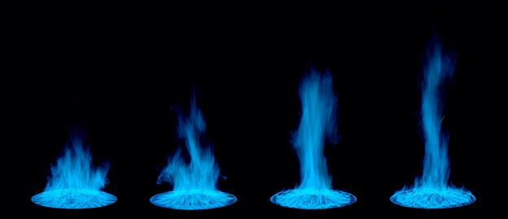
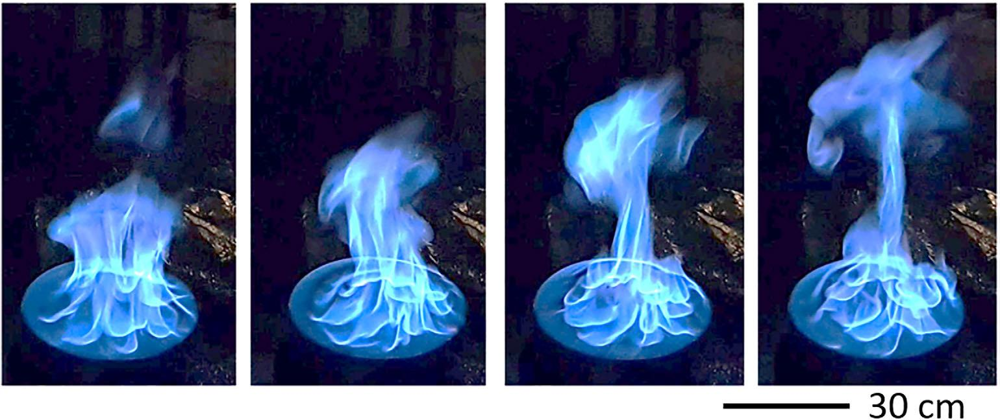

## NIST Pool Fires

This directory contains experimental measurements of liquid and gaseous pool fires. Results using two circular, liquid pool burners are reported, 30 cm and 100 cm in diameter. Results using a 37 cm diameter, water-cooled, gaseous burner are also reported.  Experimental results are reported for steadily burning fires in a well-ventilated, quiescent environment. A warm-up period of 10 min was required for the mass burning rate of the liquid fuels to be steady.

| D (cm) | Fuel | Mass Flux g/(m2-s) | Surf Temp(°C)++ | Rad Frac | Puf Freq (Hz) | TC Profile  | TC Bead (µm) | References |
|----------|------|-------------------------------|----------------|----------------------|------|-----------|-------------|------------|
| 30.1    | Methanol | 13.1 ± 0.9   | 64.5±0.3| 0.22 ± 0.02 | 2.64 ± 0.06 | r=0; z=3.8, 30.8 | 225   | 1,2,3,4,5+, 6\*,7,9,10,16\*\* |
| 30.1    | Methanol | 13.1 ± 0.9   | 64.5±0.3| 0.22 ± 0.02 |             | r=0              | 52    | 13+                           |
| 30.1    | Methanol | 13.1 ± 0.9   | 64.6±0.3| 0.22 ± 0.02 |             | z=41, 51, 61     | 150   | 15+                           |
| 30.1    | Ethanol  | 14.8 ± 1.2   | 78.3±0.2| 0.26 ± 0.07 |             | r=0              | 119   | 1,2,3,6\*,13+          |
| 30.1    | Acetone  | 18.3 ± 0.6   |56.1±0.4 | 0.31 ± 0.06 |             | r=0              | 103   | 1,2,3,6\*,13+          |
| 37    | Methane  | 6.4 ± 0.1    | 40 ± 10 | 0.15        |             | r=0              | 52    | 3,12\*,13+,14\*        |
| 37    | Propane  | 4.16 ± 0.12  | 40 ± 10 | 0.15        | 2.31 ± 0.10 | r=0              | 125   | 12\*, 13+,14\*,17\*\*  |
| 37    | Propane  | 6.9 ± 0.1    | 40 ± 10 | 0.22        | 2.31 ± 0.10 | r=0              | 125   | 12\*, 13+,14\*,17\*\*  |
| 100.6 | Methanol | 16.3 ± 0.2   | 64.5±0.3| 0.21 ± 0.01 | 1.37        | r=0; z=21,61,101,141,181 | 153   | 1\*,7\*,8(\*,\*\*),15+ |

\* radiative fraction  
\*\* puffing frequency  
+ thermocouple (TC) properties.  
++ the liquid fuel surface temperature is taken as the boiling point based on measurements at the pool surface [8], using the data provided in [19].

Sequential photographs during a puffing cycle of the 100 cm methanol pool fire.

Sequential photographs during a puffing cycle of the 30 cm methanol pool fire.

## Description of Burners and Coordinate System

Schematic drawing of a liquid burner, illustrating its features. The table below lists the burner's diameter, depth, and wall thickness for the various studies of interest. The lip height used in the various references is also listed. 

| D (cm)| Lip (mm) | Depth (cm) | Wall (mm) | Material      |References |
|-------|----------|------------|-----------|---------------|------------|
| 30.1  | 5        | 15         | 1.3       |stainless steel| 1,4,5,8    |
| 30.1  | 10       | 15         | 1.3       |stainless steel| 2,3,6,13,16|
| 37    | 0        | ~10        | NA        |porous bronze  | 1,12,17    |    
| 100   | 5        | 15         | 1.7       |steel          | 7          |
| 100   | 10       | 15         | 1.7       |steel          | 8          |

* Burners

     * The "30 cm NIST burner" is made of stainless stel and has an (inner) diameter of 30.1 cm, a wall thickness of 1.3 mm, and a depth of 15 cm. (Kim et al, 2019) The stainless steel burner is fitted with legs such that the burner rim is positioned 30 cm above the floor. The bottom of the burner is maintained at a constant temperature by flowing tap water (nominally 20 °C) through a 3 cm section on the bottom of the fuel pan. 

     * The Waterloo burner was reported to be "30.5 cm diameter." (Weckman and Strong, 1996) Personal communication with Weckman (2020) clarifies that the _outer_ diameter of the burner is 30.5 cm, the wall thickness is 0.15 cm, and the depth is 6.0 cm. 

     * The "100 cm NIST burner" is made of steel and has an inner diameter of 100 cm, a depth of 15 cm, and a wall thickness of 1.6 mm. The bottom of the burner is water cooled (approximately 17 ± 3°C) and was positioned on bricks such that the rim was about 40 cm above the floor. (Sung et al., 2020; 2021a) 

* For convenience, all experimental data reported here use a cylindrical coordinate system with the **fuel surface as the z-axis origin** (see burner drawing above) and the pool center as the r-axis origin.

* **NOTE**: In some instances the coordinate frame has been shifted from what was reported in the literature such that the origin is the fuel surface instead of the top of the burner rim. Many of the liquid pool fire references report results using the burner rim (top of the lip) as the z-axis origin (Hamins et al., 1994; Klassen et al., 1994; Hamins and Lock, 2016; Kim et al., 2019, Sung et al., 2020). Some liquid pool fire references report results using the fuel surface as the z-axis origin (Falkenstein-Smith et al, 2020a; 2020b; 2021a).

* The **lip height** (distance from the top of the burner rim to the fuel surface - see the burner schematic drawing above) varied from study to study (see table above). 

     * For the 30 cm diameter methanol pool fires, Weckman and Strong (1996), Kim et al. (2019), Falkenstein-Smith et al (2020a; 2020b), and Sung et al. (2020; 2021b) report a lip height of 10 mm, whereas Hamins et al. (1994), Klassen et al. (1994) and Hamins and Lock (2016) report a lip height of 5 mm.

     * For the 30 cm diameter ethanol and acetone pool fires, Kim et al. (2019) report a lip height of 10 mm.

     * The lip height of the 37 cm gaseous burner studies was zero. 

### Fuel Surface Temperature

* The table at the top of the page shows the fuel surface temperatures for the fires burning liquid and gaseous fuels. 

     * For liquid fuels, measurements show that the fuel surface temperature is close to the fuel boiling point. For example, see Sung et al. (2020).

     * The 37 cm gaseous burner (zero lip height) is water-cooled and maintains a near-ambient temperature at the burner surface (typically about 40°C).

### Fuel Mass Flux

* The table at the top of the page shows the measured mass flux for all the pool fires averaged over the results reported by the references in the table.

     * The measured mass flux for the 30 cm methanol pool fire, averaged over the various studies, is 13.1 ± 0.9 g/(m2 s) (Kim et al., 2019; Buch et al. 1997; Klassen and Gore, 1994; Weckman and Strong, 1996; Hamins et al., 1994; Falkenstein-Smith et al., 2020a, 2020b).

### Radiative Fraction

* The table at the top of the page shows the measured radiative fraction for the pool fires averaged over the results reported by the cited references.

* 30 cm Methanol Pool Fire

     * The measured radiative fraction for the 30 cm methanol pool fire, averaged over the various studies, is 0.22 ± 0.02 based on the cited references (Kim et al., 2019; Buch et al., 1997; see discussion of Klassen and Gore's 1994 results in Sung et al., 2020).

* 100 cm Methanol Pool Fire

     * The measured radiative fraction for the 100 cm methanol pool fire is 0.21 ± 0.01 (Sung et al., 2020). 
      
     * The radiative fraction measured by Klassen and Gore was recalculated using the net heat of combustion of 19940 kJ/kg and to improve the estimate of radiative heat feedback to the pool surface (see Sung et al., 2020). 
     
     * The same exact burner was used by Klassen and Gore (1994) and Sung et al. (2020).   

### Combustion Efficiency
* For the methanol, ethanol and acetone pool fires, the amount of CO in the exhaust stream was measured to be below detection limits, so the combustion efficiency is thought to be close to 1. (Kim et al., 2019; Sung et al, 2020)

### Puffing Frequency

* The table at the top of the page lists the dominant puffing frequency of the fires, determined from analysis of features of the plume (e.g., flame height). For more detail, see the references cited in the table.

* The same pool fire puffing frequency (f) is expected for pool fires of the same diameter (D), which has been shown to be **f = 1.5/√D** (Pagni, 1990)

## Local Measurements

### Temperature

* Mean and RMS thermocouple temperature measurements (TC and TC_RMS) were made using fine-wire, bare-bead, Type S and Type R (platinum/platinum-rhodium), thermocouples with approximately spherical beads. 
 
* Mean and RMS gas temperatures (TG and TG_RMS) were estimated for some of the temperature data, in which the TC and TC_RMS measurements are corrected for radiative loss and thermal inertia. (Sung et al., 2020; 2021a; 2021b)

* The table at the top of the page lists the thermocouple bead diameter (see column lableded "TC Bead") used for each of the temperature profiles. 

| Experimental Data Filename  |  Description             |
|-----------------------------|--------------------------|
|  Acetone_30_cm_TC_r=0_Falkenstein-Smith_2021a.csv | Centerline thermocouple and gas temperature measurements. (Falkenstein-Smith et al., 2021a) |
| Ethanol_30_cm_TC_r=0_Falkenstein-Smith_2021a.csv | Centerline thermocouple temperature measurements. (Falkenstein-Smith et al., 2021a) |
| Methanol_30_cm_TC_r=0_Hamins_2016.csv | Centerline thermocouple temperature measurements. (Hamins and Lock, 2016) |
| Methanol_30_cm_TC_r=0_Falkenstein-Smith_2021a.csv  | Centerline thermocouple temperature measurements. (Falkenstein-Smith et al., 2021a)|
| Methanol_30_cm_TC_z=3p8_cm_Hamins_2016.csv  | Radial thermocouple temperature measurements made at z=3.8 cm above the fuel surface. (Hamins and Lock, 2016)|
| Methanol_30_cm_TC_z=30p8_cm_Hamins_2016.csv |Radial thermocouple temperature measurements made at z=30.8 cm above the fuel surface. (Hamins and Lock, 2016)|
| Methanol_30_cm_TC_z=41_cm_Sung_2021b.csv  | Radial thermocouple temperature measurements made at z=41 cm above the fuel surface. (Sung et al., 2021b) |
| Methanol_30_cm_TC_z=51_cm_Sung_2021b.csv  | Radial thermocouple temperature measurements made at z=51 cm above the fuel surface. (Sung et al., 2021b)|
| Methanol_30_cm_TC_z=61_cm_Sung_2021b.csv  | Radial thermocouple temperature measurements made at z=61 cm above the fuel surface. (Sung et al., 2021b) |
| Methane_37_cm_TC_r=0_Falkenstein-Smith_2021a.csv  | Centerline thermocouple and gas temperature measurements. (Falkenstein-Smith et al., 2021a) |
| Propane_37_cm_34_kW_TC_r=0_Falkenstein-Smith_2021a.csv | Centerline thermocouple and gas temperature measurements. (Falkenstein-Smith et al., 2021a) |
| Propane_37_cm_20_kW_TC_r=0_Falkenstein-Smith_2021a.csv | Centerline thermocouple and gas temperature measurements. (Falkenstein-Smith et al., 2021a) |
| Methanol_100_cm_TC_r=0_Sung 2021a.csv  | Centerline thermocouple and gas temperature measurements. (Sung et al., 2021a) |
| Methanol_100_cm_TC_z=101_cm_Sung_2021a.csv | Radial thermocouple and gas temperature measurements at z=101 cm above the fuel surface. (Sung et al., 2021a) |
| Methanol_100_cm_TC_z=141_cm_Sung_2021a.csv | Radial thermocouple and gas temperature measurements at z=141 cm above the fuel surface. (Sung et al., 2021a) |
| Methanol_100_cm_TC_z=181_cm_Sung_2021a.csv | Radial thermocouple and gas temperature measurements at z=181 cm above the fuel surface. (Sung et al., 2021a)|
| Methanol_100_cm_TC_z=21_cm_Sung_2021a.csv | Radial thermocouple and gas temperature measurements at z=21 cm above the fuel surface. (Sung et al., 2021a)|
| Methanol_100_cm_TC_z=61_cm_Sung_2021a.csv | Radial thermocouple and gas temperature measurements at z=61 cm above the fuel surface. (Sung et al., 2021a) |

### Gas Species and Soot

* Gas species measurements were made along the fire centerline (r=0), using extractive sampling with a water-cooled probe, injecting the sample into a gas chromatograph/mass spectrometer system (GC/MSD). The volume fraction of each species was calculated based on the number of moles measured by the GC/MSD. Falkenstein-Smith et al. (2021a).
 
* Soot mass fractions were measured gravimetrically during the gas sampling process. 

| Experimental Data Filename            |  Description             |
|---------------------------------------|--------------------------|
| Acetone_30_cm_species_r=0_Falkenstein-Smith_2021a.csv | Mean gas species and soot, and their uncertainties as a function of distance above the fuel surface along the pool centerline (r=0).|
|Ethanol_30_cm_species_r=0_Falkenstein-Smith_2021a.csv |Mean gas species and soot, and their uncertainties as a function of distance above the fuel surface along the pool centerline (r=0). |
| Methanol_30_cm_species_r=0_Falkenstein-Smith_2021a.csv |Mean gas species and their uncertainties as a function of distance above the fuel surface along the pool centerline (r=0). There is no measurable soot in the methanol fire. |
| Methane_37_cm_species_r=0_Falkenstein-Smith_2021a.csv | Mean gas species and soot, and their uncertainties as a function of distance above the fuel surface along the pool centerline (r=0). |
| Propane_37_cm_20_kW_species_r=0_Falkenstein-Smith_2021a.csv| Mean gas species and soot, and their uncertainties as a function of distance above the fuel surface along the pool centerline (r=0). |
| Propane_37_cm_34_kW_species_r=0_Falkenstein-Smith_2021a.csv | Mean gas species and soot, and their uncertainties as a function of distance above the fuel surface along the pool centerline (r=0). |

### Heat Flux

* Radiative and total heat flux measurements were made at various locations in the 30 cm and 100 cm methanol pool fires, mapping the heat flux emitted radially outward from the vertical surface and downwards through the bottom surface of a cylindical control volume about the fire.

| Experimental Data Filename               |  Description                     |
|------------------------------------------|----------------------------------|
| Methanol_30_cm_HF_radial_z=p7_cm_Hamins_1994.csv | Radial profile of radiative heat flux in the downward direction from the pool center (r = 0) towards the burner edge (r ≅ 15 cm). The heat flux gauges were z = 0.7 cm above the fuel surface and oriented in the upward direction. (Hamins et al., 1994)  |
| Methanol_30_cm_HF_radial_z=1p3_cm_Kim_2019.csv| Radial profile of total heat flux in the downward direction from the pool center (r = 0) to r = 15 cm.  The heat flux gauges were oriented in the upward direction and positioned z = 1.3 cm above the fuel surface for 0 ≤ r (cm) ≤ 15. (Kim et al., 2019) |
| Methanol_30_cm_HF_radial_z=1_cm_Kim_2019.csv| Radial profile of total heat flux in the downward direction from r = 15 to 150 cm.  The heat flux gauges were oriented in the upward direction and positioned z = 1.0 cm above the fuel surface for 0 ≤ r (cm) ≤ 15, respectively. (Kim et al., 2019) |
| Methanol_30_cm_HF_radial_z=p5_cm_Klassen_1994.csv |Radial profile of total heat flux in the downward direction from the burner edge (r = 15 cm) to r = 85 cm. The heat flux gauges were z = 0.5 cm above the fuel surface and oriented in the upward direction. (Klassen and Gore, 1994) |
|Methanol_30_cm_HF_vertical_r=60_cm_Kim_2019.csv| Vertical profile of total heat flux emitted radially away from the fire acquired at various heights above the fuel surface at r = 60 cm. The heat flux gauges were oriented towards the fire centerline. (Kim et al., 2019) |
|Methanol_100_cm_HF_radial_z=1_cm_Sung_2019.csv | Radial profile of total heat flux in the downward direction from the burner edge (r = 50 cm) to r = 200 cm. The heat flux gauges were 1 cm above the fuel surface and oriented in the upward direction. (Sung et al., 2020) |
| Methanol_100_cm_HF_Vertical_z=41_cm_Sung_2019.csv |Vertical profiles of total heat flux emitted radially away from the fire acquired at z=41 cm above the fuel surface for varying r distances with the gauges oriented towards the fire centerline. (Sung et al., 2020)|
| Methanol_100_cm_HF_Vertical_z=61_cm_Sung_2019.csv |Vertical profiles of total heat flux emitted radially away from the fire acquired at z=61 cm above the fuel surface for varying r distances with the gauges oriented towards the fire centerline. (Sung et al., 2020) |
| Methanol_100_cm_HF_Vertical_z=81_cm_Sung_2019.csv |Vertical profiles of total heat flux emitted radially away from the fire acquired at z=81 cm above the fuel surface for varying r distances with the gauges oriented towards the fire centerline. (Sung et al., 2020) |
| Methanol_100_cm_HF_Vertical_r=207p5_cm_Sung_2019.csv| Vertical profiles of total heat flux emitted radially away from the fire acquired at r=207.5 cm above the fuel surface for z distances from 1 to 180.5 cm above the fuel surface with the gauges oriented towards the fire centerline. (Sung et al., 2020) |

### Velocity

* Bi-directional probe measurements were made at various z locations on the centerline of the pool fires, mapping the speed of the plume in the upward direction. 

| Experimental Data Filename  |  Description             |
|-----------------------------|--------------------------|
| Acetone_30_cm_U_r=0_Sung_2021b.csv | Profile of the vertical component of velocity in the upward direction as a function of distance (z) above the fuel surface. (Sung et al., 2021b; Falkenstein - Smith et al., 2021a|
| Ethanol_30_cm_U_r=0_Sung_2021b.csv | Profile of the vertical component of velocity in the upward direction as a function of distance (z) above the fuel surface. (Sung et al., 2021b; Falkenstein - Smith et al., 2021a|
| Methanol_30_cm_U_r=0_Sung_2021b.csv | Profile of the vertical component of velocity in the upward direction as a function of distance (z) above the fuel surface. (Sung et al., 2021b; Falkenstein - Smith et al., 2021a|  
| Methane_37_cm_U_r=0_Sung_2021b.csv | Profile of the vertical component of velocity in the upward direction as a function of distance (z) above the fuel surface. (Sung et al., 2021b; Falkenstein - Smith et al., 2021a|
|Propane_20_kW_37_cm_U_r=0_Sung_2021b.csv |Profile of the vertical component of velocity in the upward direction as a function of distance (z) above the fuel surface. (Sung et al., 2021b; Falkenstein - Smith et al., 2021a; 2021b|
|Propane_34_kW_37_cm_U_r=0_Sung_2021b.csv |Profile of the vertical component of velocity in the upward direction as a function of distance (z) above the fuel surface. (Sung et al., 2021b; Falkenstein - Smith et al., 2021a; 2021b |

### Heat Release Rate (HRR)

* The table at the top of the page shows the measured mass flux and the measured radiative fraction. For covienence, the measured mass flux per unit area of the fuel surface (in kg/s/m2) and the radiative fraction are provided  in the files below: 

| Experimental Data Filename  |  Description             |
|-----------------------------|--------------------------|
| Acetone_30_cm_HRR.csv  | Mass flux per unit area of the fuel surface and the radiative flux |
| Ethanol_30_cm_HRR.csv  | Mass flux per unit area of the fuel surface and the radiative flux |
| Methanol_30_cm_HRR.csv  | Mass flux per unit area of the fuel surface and the radiative flux |
| Methanol_100_cm_HRR.csv  | Mass flux per unit area of the fuel surface and the radiative flux |

## References

1. Buch, R., Hamins, A., Konishi, K., Mattingly, D., and Kashiwagi, T., Radiative Emission Fraction of Pool Fires Burning Silicone Fluids, Combust. Flame, 108, 118-126 (1997). https://www.nist.gov/publications/radiative-emission-fraction-pool-fires-burning-silicone-fluids

2. Falkenstein-Smith, R., K. Sung, J. Chen, and A. Hamins, Chemical Structure of Medium-Scale Liquid Pool Fires, Fire Safety Journal, available on-line 14 May 2020a, https://doi.org/10.1016/j.firesaf.2020.103099

3. Falkesntein-Smith, R., K. Sung, Chen, J., Harris, K., A. Hamins, The Structure of Medium-Scale Pool Fires, NIST Technical Note 2082, National Institute of Standards and Technology, Gaithersburg, MD, February 2020b. https://doi.org/10.6028/NIST.TN.2082

4. Hamins, A., M. Klassen, J. Gore, S. Fischer, T. Kashiwagi, Heat feedback to the fuel surface in pool fires, Combustion Science and Technology, 97:37-62 (1994).

5. Hamins, A. and A. Lock, The Structure of a Moderate-Scale Methanol Pool Fire, NIST Technical Note 1928, National Institute of Standards and Technology, Gaithersburg, MD, November 2016. https://doi.org/10.6028/NIST.TN.1928

6. Kim, S.C., K.Y. Lee, and A. Hamins, Energy Balance in Medium-Scale Methanol, Ethanol, and Acetone Pool Fires, Fire Safety Journal, 107:44-53 (2019). https://doi.org/10.1016/j.firesaf.2019.01.004

7. Klassen, M. and J.P. Gore, Structure and Radiation Properties of Pool Fires, NIST GCR 94-651, National Institute of Standards and Technology, Gaithersburg, MD, June 1994. https://ntrl.ntis.gov/NTRL/dashboard/searchResults/titleDetail/PB94193802.xhtml#

8. Sung, K., J. Chen, M. Bundy, M. Fernandez, and Hamins, A., The Thermal Character of a 1 m Methanol Pool Fire,  NIST Technical Note 2083, National Institute of Standards and Technology, Gaithersburg, MD, January 2020. https://doi.org/10.6028/NIST.TN.2083; Second Edition, 2021a (in internal review).

9. Weckman, E.J.; Personal Communication, Email to A. Hamins, 28 August 2020.

10. Weckman, E.J. and A.B. Strong, Experimental investigation of the turbulence structure of medium-scale methanol pool fires, Combustion and Flame, 105:245-66 (1996). https://doi.org/10.1016/0010-2180(95)00103-4

11. SFPE Handbook of Fire Protection Engineering (5th ed.), Appendix 3, Fuel Properties and Combustion Data (Ed.: M. Hurley) 2016.

12. Hamins, A., Konishi, K., Borthwick, P, Kashiwagi, T., Global Properties of Gaseous Pool Fires, Proceedings Combustion Institute, 26:1429-1436 (1996).  https://www.nist.gov/publications/global-properties-gaseous-pool-fires

13. Falkenstein-Smith, R., K. Sung, Chen, J., Harris, K., A. Hamins, The Structure of Medium-Scale Pool Fires, NIST Technical Note 2082, Second Edition, National Institute of Standards and Technology, Gaithersburg, MD,  2021a (in preparation).

14. A. Hamins, Energetics of Small and Moderate-Scale Gaseous Pool Fires,  NIST Technical Note 1926, National Institute of Standards and Technology, Gaithersburg, MD, November 2016. https://doi.org/10.6028/NIST.TN.1926

15. Sung, K., Falkenstein-Smith, R., and Hamins, A., Velocity and Temperature Structure of Medium-Scale Pool Fires, NIST Technical Note in preparation, National Institute of Standards and Technology, Gaithersburg, MD, 2021b.

16. Wang, Z., Tam, W.C, Chen, J., Lee, K.Y., and Hamins, A., Thin Filament Pyrometry Field Measurements in a Medium-Scale Pool Fire, Fire Technology, (2019). https://doi.org/10.1007/s10694-019-00906-9

17. Falkenstein-Smith, R, Sung, KH, Hamins, A, The Structure of Medium-Scale Propane Pool Fires, 12th US National Combustion Meeting, in review, May 24-26 2021b.

18. Pagni, P. J., Pool fire vortex shedding frequencies,” in Some Unanswered Questions in Fluid Mechanics, edited by L. M. Trefethen and R. L. Panton, Applied Mechanics Reviews, 43(8), 166 (1990).

19. Burgess, D. R. Jr., and Hamins, A., Heats of Combustion and Related Properties of Pure Substances, NIST Technical Note 2126 (in preparation), National Institute of Standards and Technology, Gaithersburg, MD 20899, 2021, to appear in the Appendices of the 6th Edition of the SFPE Handbook. 
