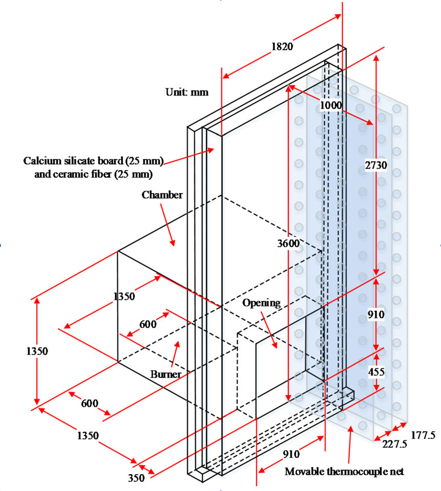
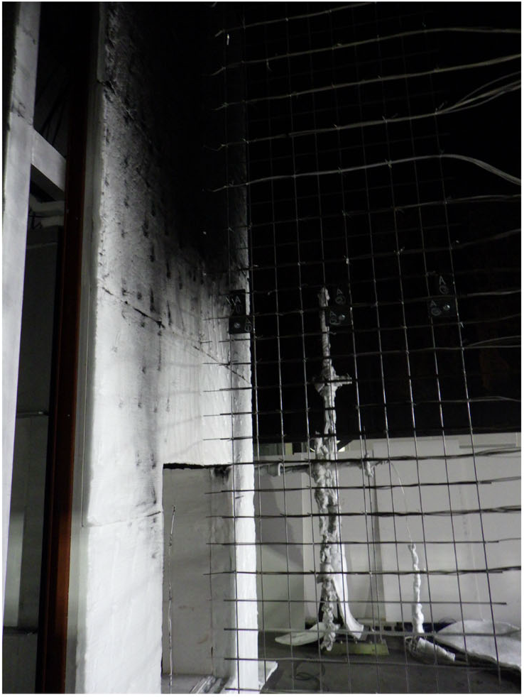
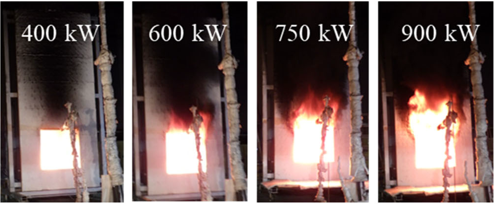

## JIS A 1310 façade calibration test

The full-scale façade standard test is widely employed as a comprehensive method to assess the façade fire spread. Within this approach, the calibration test without combustible façade decouples the intricate interaction between gas-phase combustion and material pyrolysis, which simplifies diagnostics and provides an ideal scenario for model validation. This repository contains data for calibration tests in accordance with JIS A 1310. The calibration tests
were conducted to obtain the flame morphologies, gas-phase temperature, and heat flux of over-ventilated façade fires. The results of Sun et al. (Fire & Materials, 2024) highlight that the enhancement of sidewall in façade flame spread occurs under external heat release rate, and the 0.2 m sidewall distance for the designated JIS test is identified as a critical threshold increasing façade thermal load.

 

#### Experimental Data Files

Experimental data are tabulated in [JIS_Facade/Experimental_Data](https://github.com/MaCFP/macfp-db/tree/master/Wall_Fires/JIS_Facade/Experimental_Data)

#### References
1. Sun, X., Yoshioka, H., Noguchi, T., Nishio, Y., Ohmiya, Y., Hayakawa, T., Zhou, B., Large eddy simulations fire modeling of JIS A 1310 façade calibration test with respect to sidewall, Fire & Materials  48 (2024) 411-425.
